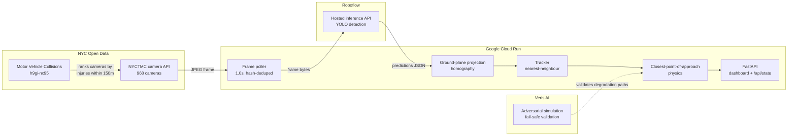

# Ghost-V2X

**Collision risk prediction from cameras New York City already owns.**

Ghost-V2X turns the existing NYC DOT traffic camera network into a
vehicle-pedestrian conflict detector. No new hardware, no new permits, no
capital expense. Point it at a camera ID and it starts predicting.

The name: V2X (vehicle-to-everything) safety systems normally require
transponders in every car and sensor masts on every corner. Ghost-V2X gets a
useful fraction of the same signal from infrastructure that is already
installed, already powered, and already streaming - vehicles participate
without knowing it.

---

## Why this matters in NYC

New York has 970+ public traffic cameras and a Vision Zero mandate. Those two
facts have never been connected in real time. Today the cameras are watched by
humans, after the fact, on a wall of monitors.

The scaling story is the pitch: going from one intersection to all of them is a
config change, not a procurement cycle.

---

## Architecture



Roboflow does the heavy computer vision in the cloud, so the Cloud Run
container stays light - no GPU, no model weights, 512 MB of memory. It is the
brain, not the eyes.

---

## Choosing the camera

Not every camera can support this. Of 968 in the NYCTMC network (965 online),
only ~619 are street intersections; the rest are expressways, bridges, and
tunnels where there are no pedestrians and so no conflict to measure.

Picking one by eye finds somewhere that *looks* busy. `rank_cameras.py` instead
scores every camera against **NYC's own collision record** (Socrata
`h9gi-nx95`): 69,090 crashes that injured a pedestrian or cyclist since 2021,
matched to cameras within 150m.

But rank alone picks the wrong camera, and only looking at the frames shows why:

| Rank | Camera | Hurt | Why it fails or works |
|---:|---|---:|---|
| 1 | Delancy St @ Essex St | 112 | Foreshortened view straight down the roadway; almost no pedestrians visible, badly conditioned homography |
| 2 | **Lenox Ave @ 125 St** | **98** | **Selected.** Crosswalk in frame, pedestrians crossing perpendicular to vehicle flow, elevated angle, moderate density |
| 3 | 7 Ave @ 43 St | 95 | Good angle and traffic, but pedestrians run parallel on sidewalks rather than crossing |
| 5 | Broadway @ 43 St | 94 | Times Square **pedestrian plaza** - huge foot traffic, no vehicles. Its crashes happen outside the frame |

### The method validates against NYC's own assessment

`rank_cameras.py` is our method. `validate_ranking.py` asks whether it is any
good, using a list we never consulted while building it: DOT publishes its own
**Vision Zero Priority Intersections** (`tmt9-43em`, 304 of them), derived
through their own independent analysis.

**All 12 of our top-ranked cameras sit on NYC's official priority list.** The
ranking reproduces the city's own safety assessment without having seen it.

That turns the camera choice from a judgement call into a reproducible
procedure - and it yields a deployment map:

| | |
|---|---:|
| NYC Vision Zero Priority Intersections | 304 |
| **already watched by a usable camera** | **99 (32%)** |
| no camera within 200m | 205 |

Ghost-V2X is deployable to **99 of the city's own priority intersections
today, with zero new hardware.** The remaining 205 are a concrete, costed
recommendation: these are the corners where a camera would buy the most safety.

---

Proximity to crashes is not the same as seeing them. The default is
**Lenox Ave @ 125 St** (`156b0613-239a-4e77-aa0e-0a4becfc0b05`): the
highest-ranked camera that actually shows the conflict it is scored on.

Times Square was rejected for a second reason that only appears on inspection.
Its pedestrian density is so high that greedy nearest-neighbour association
would throw ID switches constantly. Lenox has enough pedestrians for real
conflicts and few enough to track reliably.

Frames are **352x240**, so a mid-ground pedestrian is roughly 25px tall - hence
a confidence threshold of 0.25 rather than the usual 0.4. The camera publishes
a new frame every **~2.0s** (measured; min 1.2, max 2.5), so the app polls at
1.0s and discards duplicates by hash before spending inference on them.

---


## The part most teams get wrong

**Bounding boxes are in image space, not ground space.** Two boxes that nearly
touch on screen can be fifty feet apart in reality. A pedestrian on the near
sidewalk and a car across the intersection overlap in pixels constantly, and a
naive implementation fires HIGH RISK all night.

Ghost-V2X projects the **bottom-centre of each box** - the point where the
object meets the road - through a homography onto a metric ground plane. The
physics then runs in metres and seconds:

```
dp = p2 - p1                       relative position
dv = v2 - v1                       relative velocity
t  = -dot(dp, dv) / dot(dv, dv)    time to closest approach
d  = norm(dp + dv * t)             miss distance at that moment
```

A conflict is reported when `0 < t ≤ 8s` and `d ≤ 2.0m`. Severity comes from
`t`: HIGH ≤ 3s, MEDIUM ≤ 5s, otherwise LOW.

Calibrate with `python calibrate.py`, then set `SRC_QUAD` / `DST_QUAD`. Rough
is fine - within 20% of true scale is dramatically better than image space.

---

## Fail-safe behaviour

The system's job is to **stop asserting things about the street** the moment it
loses confidence. A stale `HIGH` is far more dangerous than an honest `UNKNOWN`,
because it trains operators to ignore the alert.

| Condition | Response |
|---|---|
| Camera returns a dark or truncated frame | Frame rejected before inference |
| 2 consecutive cycle failures | `FAIL_SAFE`, risk → `UNKNOWN`, tracks cleared |
| 5 consecutive failures | Camera re-selected - this one may be in maintenance |
| Roboflow 5xx / timeout | Caught per-cycle, loop survives, degrades on repeat |
| No API key configured | Boots to `FAIL_SAFE` and still serves |
| Any pipeline failure | `/healthz` stays green - Cloud Run must not restart us |

Nothing in the loop can raise. The signalling recommendation on failure is
always "normal fixed timing" - the grid never freezes waiting on this service.

Adversarial scenarios are exercised by `chaos_test.py`, which drives the real
`loop()` against a mocked network across nine failures: dark camera, Roboflow
500, Roboflow timeout, rejected key, frozen feed, list-endpoint outage,
recovery, and liveness. **9/9 pass.** It is reproducible in 30 seconds rather
than being a screenshot, and it earned its keep immediately by finding a real
bug: the frame hash was committed before inference, so a failed inference on a
static frame was never retried and the system sat stale instead of degrading.

```bash
python chaos_test.py
```

## Alerting

Alerts POST on **transitions**, not every frame - a per-frame POST at 1/sec
floods the events dashboard and buries the alerts that matter. An anti-flap
floor rate-limits churn, but **escalation bypasses it**: risk climbing toward
`HIGH` is the one event that must never be delayed.

`UNKNOWN` maps to `No_Action`. When the system cannot see the street it must
never request an intervention; the grid falls back to normal fixed timing.

A failed webhook POST never stops sensing. It is recorded in `alert_error` and
the loop keeps polling.

### Demoing without waiting for real traffic

```bash
curl -X POST https://<your-service>/api/replay
```

Drives a synthetic car closing on a crossing pedestrian through the **same**
tracker, physics, and alerting path as live traffic - only the detections are
synthetic, and the dashboard reason says so. A live demo should not depend on
Harlem producing a genuine near-miss during the ninety seconds you are on
stage.

---

## Run it

### Cloud Run

```bash
gcloud config set project YOUR_PROJECT_ID
./deploy.sh
```

Then add your Roboflow key without a rebuild:

```bash
gcloud run services update ghost-v2x --region us-central1 \
  --set-env-vars ROBOFLOW_API_KEY=xxx,ROBOFLOW_MODEL=your-model/1
```

> `--min-instances 1` is deliberate. Cloud Run scales to zero when idle, which
> would kill the background polling loop between requests. This service is a
> continuously running sensor, not a request handler.

### Locally

```bash
pip install -r requirements.txt
uvicorn main:app --reload
```

---

## Configuration

| Variable | Default | Purpose |
|---|---|---|
| `CAMERA_ID` | `156b0613…` (Lenox @ 125) | Pin an exact camera; wins over `CAMERA_MATCH` |
| `CAMERA_MATCH` | `Lenox Ave @ 125 St` | Substring match on camera name |
| `POLL_SECONDS` | `1.0` | Poll cadence; camera refreshes ~2.0s, dupes discarded |
| `ROBOFLOW_API_KEY` | *(unset)* | Without it, boots to `FAIL_SAFE` |
| `ROBOFLOW_MODEL` | `vehicle-detection-3mmwj/1` | `model-slug/version` |
| `CONFIDENCE` | `0.25` | Detection threshold (frames are only 352x240) |
| `SRC_QUAD` | Lenox estimate | 4 road-surface points, fractions of w,h |
| `DST_QUAD` | `0,22 18,22 18,0 0,0` | Same 4 points in metres |
| `TTC_HORIZON_S` | `8.0` | Ignore conflicts further out than this |
| `MISS_DISTANCE_M` | `2.0` | Proximity that counts as a conflict |
| `WEBHOOK_URL` | *(unset)* | Where alerts POST; unset disables alerting |
| `WEBHOOK_AUTH_HEADER` | `Authorization` | Auth header name |
| `WEBHOOK_AUTH_VALUE` | *(unset)* | Auth header value |
| `WEBHOOK_MIN_INTERVAL_S` | `3.0` | Anti-flap floor; escalations bypass it |

---

## Endpoints

| Route | Purpose |
|---|---|
| `/` | Live dashboard, polls every 1.5s |
| `/api/state` | Full state as JSON |
| `/api/alert` | Exactly what would be POSTed right now (webhook debugging) |
| `POST /api/replay` | Trigger the synthetic near-miss - safe to hit live on stage |
| `/healthz` | Liveness - green even in `FAIL_SAFE` |

---

## Honest limitations

Stated up front, because a system like this is only useful if you know where it
stops being trustworthy.

- **A 2.5s polling cadence means a ~5s velocity baseline.** A pedestrian covers
  roughly 7 metres in that time. This is a **risk indicator for signal timing
  and hotspot analysis, not a real-time driver warning.** Sub-second latency
  would need a genuine video stream, not still-image polling.
- **A single monocular camera has no depth.** The homography assumes everything
  sits on one flat plane. An object on a truck bed or a raised median projects
  incorrectly.
- **Occlusion breaks tracking.** A pedestrian passing behind a bus becomes a new
  track ID with no velocity history for at least one cycle.
- **Detection quality is inherited** from the upstream Roboflow model. Night,
  rain, and low camera angles all degrade it.
- **Calibration is per-camera.** Scaling to 970 cameras needs automated ground
  plane estimation, which is not built.

---

## Stack

NYC Open Data (NYCTMC cameras + Motor Vehicle Collisions) | Google Cloud Run |
Roboflow Hosted Inference | Veris AI | FastAPI | NumPy
