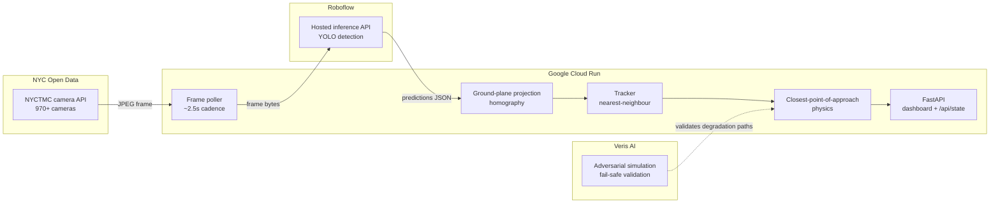

# Ghost-V2X

**Collision risk prediction from cameras New York City already owns.**

Ghost-V2X turns the existing NYC DOT traffic camera network into a
vehicle-pedestrian conflict detector. No new hardware, no new permits, no
capital expense. Point it at a camera ID and it starts predicting.

The name: V2X (vehicle-to-everything) safety systems normally require
transponders in every car and sensor masts on every corner. Ghost-V2X gets a
useful fraction of the same signal from infrastructure that is already
installed, already powered, and already streaming - vehicles participate
without knowing it.

---

## Why this matters in NYC

New York has 970+ public traffic cameras and a Vision Zero mandate. Those two
facts have never been connected in real time. Today the cameras are watched by
humans, after the fact, on a wall of monitors.

The scaling story is the pitch: going from one intersection to all of them is a
config change, not a procurement cycle.

---

## Architecture



Roboflow does the heavy computer vision in the cloud, so the Cloud Run
container stays light - no GPU, no model weights, 512 MB of memory. It is the
brain, not the eyes.

---

## Choosing the camera

Not every camera can support this. Of 968 in the NYCTMC network (965 online),
only ~619 are street intersections at all; the rest are expressways, bridges,
and tunnels where there are no pedestrians and therefore no vehicle-pedestrian
conflict to measure.

`scout_cameras.py` filters the roster and pulls candidate frames to inspect.
The default is **Broadway @ 46 St - Quad South**
(`1927b469-e2dc-4943-a70c-e6e52fd4c48c`), picked by looking at eight live
frames. It is the only candidate combining all four requirements:

1. heavy pedestrian volume (Times Square);
2. active vehicle traffic;
3. an elevated angle that actually shows the road surface, rather than a
   foreshortened view straight down the roadway;
4. a zebra crosswalk, whose real-world dimensions calibrate the ground plane.

Frames are **352x240**, so a mid-ground pedestrian is roughly 25px tall. That
is why the confidence threshold defaults to 0.25 rather than the usual 0.4.

---

## The part most teams get wrong

**Bounding boxes are in image space, not ground space.** Two boxes that nearly
touch on screen can be fifty feet apart in reality. A pedestrian on the near
sidewalk and a car across the intersection overlap in pixels constantly, and a
naive implementation fires HIGH RISK all night.

Ghost-V2X projects the **bottom-centre of each box** - the point where the
object meets the road - through a homography onto a metric ground plane. The
physics then runs in metres and seconds:

```
dp = p2 - p1                       relative position
dv = v2 - v1                       relative velocity
t  = -dot(dp, dv) / dot(dv, dv)    time to closest approach
d  = norm(dp + dv * t)             miss distance at that moment
```

A conflict is reported when `0 < t ≤ 8s` and `d ≤ 2.0m`. Severity comes from
`t`: HIGH ≤ 3s, MEDIUM ≤ 5s, otherwise LOW.

Calibrate with `python calibrate.py`, then set `SRC_QUAD` / `DST_QUAD`. Rough
is fine - within 20% of true scale is dramatically better than image space.

---

## Fail-safe behaviour

The system's job is to **stop asserting things about the street** the moment it
loses confidence. A stale `HIGH` is far more dangerous than an honest `UNKNOWN`,
because it trains operators to ignore the alert.

| Condition | Response |
|---|---|
| Camera returns a dark or truncated frame | Frame rejected before inference |
| 2 consecutive cycle failures | `FAIL_SAFE`, risk → `UNKNOWN`, tracks cleared |
| 5 consecutive failures | Camera re-selected - this one may be in maintenance |
| Roboflow 5xx / timeout | Caught per-cycle, loop survives, degrades on repeat |
| No API key configured | Boots to `FAIL_SAFE` and still serves |
| Any pipeline failure | `/healthz` stays green - Cloud Run must not restart us |

Nothing in the loop can raise. The signalling recommendation on failure is
always "normal fixed timing" - the grid never freezes waiting on this service.

Adversarial scenarios were exercised in **Veris AI** (see `docs/veris-report.png`).

---

## Run it

### Cloud Run

```bash
gcloud config set project YOUR_PROJECT_ID
./deploy.sh
```

Then add your Roboflow key without a rebuild:

```bash
gcloud run services update ghost-v2x --region us-central1 \
  --set-env-vars ROBOFLOW_API_KEY=xxx,ROBOFLOW_MODEL=your-model/1
```

> `--min-instances 1` is deliberate. Cloud Run scales to zero when idle, which
> would kill the background polling loop between requests. This service is a
> continuously running sensor, not a request handler.

### Locally

```bash
pip install -r requirements.txt
uvicorn main:app --reload
```

---

## Configuration

| Variable | Default | Purpose |
|---|---|---|
| `CAMERA_ID` | `1927b469…` (Bway @ 46) | Pin an exact camera; wins over `CAMERA_MATCH` |
| `CAMERA_MATCH` | `Broadway @ 46 St- Quad South` | Substring match on camera name |
| `POLL_SECONDS` | `2.5` | Frame cadence |
| `ROBOFLOW_API_KEY` | *(unset)* | Without it, boots to `FAIL_SAFE` |
| `ROBOFLOW_MODEL` | `vehicle-detection-3mmwj/1` | `model-slug/version` |
| `CONFIDENCE` | `0.25` | Detection threshold (frames are only 352x240) |
| `SRC_QUAD` | *placeholder* | 4 image points, fractions of w,h |
| `DST_QUAD` | *placeholder* | Same 4 points in metres |
| `TTC_HORIZON_S` | `8.0` | Ignore conflicts further out than this |
| `MISS_DISTANCE_M` | `2.0` | Proximity that counts as a conflict |

---

## Endpoints

| Route | Purpose |
|---|---|
| `/` | Live dashboard, polls every 1.5s |
| `/api/state` | Full state as JSON |
| `/healthz` | Liveness - green even in `FAIL_SAFE` |

---

## Honest limitations

Stated up front, because a system like this is only useful if you know where it
stops being trustworthy.

- **A 2.5s polling cadence means a ~5s velocity baseline.** A pedestrian covers
  roughly 7 metres in that time. This is a **risk indicator for signal timing
  and hotspot analysis, not a real-time driver warning.** Sub-second latency
  would need a genuine video stream, not still-image polling.
- **A single monocular camera has no depth.** The homography assumes everything
  sits on one flat plane. An object on a truck bed or a raised median projects
  incorrectly.
- **Occlusion breaks tracking.** A pedestrian passing behind a bus becomes a new
  track ID with no velocity history for at least one cycle.
- **Detection quality is inherited** from the upstream Roboflow model. Night,
  rain, and low camera angles all degrade it.
- **Calibration is per-camera.** Scaling to 970 cameras needs automated ground
  plane estimation, which is not built.

---

## Stack

NYC Open Data (NYCTMC) | Google Cloud Run | Roboflow Hosted Inference |
Veris AI | FastAPI | NumPy
