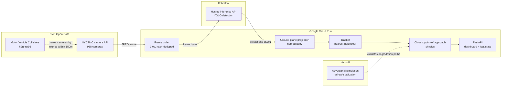

# Ghost-V2X

**Collision risk prediction from cameras New York City already owns.**

Ghost-V2X turns the existing NYC DOT traffic camera network into a
vehicle-pedestrian conflict detector. No new hardware, no new permits, no
capital expense. Point it at a camera ID and it starts predicting.

### Try it right now

| | |
|---|---|
| **Planning map** | https://ghost-v2x-73791867861.us-east1.run.app/map |
| **Who it's for** | https://ghost-v2x-73791867861.us-east1.run.app/insights |
| **Live sensor** | https://ghost-v2x-73791867861.us-east1.run.app/ |
| **Signal controller** | https://ghost-v2x-receiver-73791867861.us-east1.run.app/ |

Force a near-miss through the real tracker, physics, and alerting - no waiting
for traffic to cooperate:

```bash
curl -s -X POST -d '' https://ghost-v2x-73791867861.us-east1.run.app/api/replay
```

Then watch it reach the signal controller. The `-d ''` is required; a bodyless
POST gets a 411 from Google's frontend.

---

The name: V2X (vehicle-to-everything) safety systems normally require
transponders in every car and sensor masts on every corner. Ghost-V2X gets a
useful fraction of the same signal from infrastructure that is already
installed, already powered, and already streaming - vehicles participate
without knowing it.

---

---

## How it works, and why the method is sound

### The problem this solves

A pedestrian is struck when a vehicle and a person occupy the same space at the
same moment. That is a geometry problem before it is a perception problem, and
geometry is predictable: if you know where two objects are and how fast they
are moving, you can calculate whether their paths intersect, when, and how
closely — seconds before it happens.

The obstacle has never been the mathematics. It is that nobody is measuring
position and velocity at the intersection.

### How the rest of the world solves it

The state of the art is **roadside sensing**. China's vehicle-road-cloud
cooperative programme (车路云一体化) is the largest deployment of this idea:
roadside units combining cameras, millimetre-wave radar, and in higher
specification installations LiDAR, mounted at intersections under national
C-V2X standards, fusing detections to track road users and warn of conflicts.
Comparable work exists in EU C-ITS corridors and US Connected Vehicle pilots.

The approach is proven. It is also **capital-intensive per corner**: a sensor
package, a mast, power, backhaul, and a maintenance contract, multiplied by
every intersection you want covered. That cost is why coverage grows slowly
even where the political will exists.

### What we did differently

New York has already installed the sensors. There are **968 NYC DOT traffic
cameras**, 965 of them online, and **619 look at street intersections**. They
are powered, networked, and publicly accessible. The gap was never hardware —
it was that no one was reading them in real time.

Ghost-V2X applies the same conflict-prediction method to infrastructure that
already exists. The marginal cost of covering another intersection is a
configuration change.

### The trajectory method, step by step

**1. Detect.** Each frame is upscaled 2x and passed to a hosted detector, which
returns bounding boxes for vehicles (car, truck, bus, motorcycle) and
vulnerable road users (person, bicycle).

**2. Project onto the road surface.** This is the step most naive
implementations skip, and skipping it makes everything downstream meaningless.
Bounding boxes live in *image space*, where a pedestrian on the near sidewalk
and a car across the intersection overlap in pixels while being fifteen metres
apart in reality. We take the **bottom-centre of each box** — where the object
meets the ground — and transform it through a homography onto a flat metric
plane:

```
    [x']       [x]                          u = x'/w'
    [y']  =  H [y]        in metres:        v = y'/w'
    [w']       [1]
```

`H` is solved once from four points on the road surface mapped to their
real-world separations. After this step every position is in metres, and
distances mean what they say.

**3. Track, and derive velocity.** Detections are associated frame to frame
against each track's *predicted* position, gated by how far that class of
object could plausibly travel in the elapsed time. Two observations give a
velocity vector in m/s. Any track implying an impossible speed — above 6 m/s
for a pedestrian, 32 m/s for a vehicle — is rejected, because at fifteen
pedestrians in frame the dominant error is an identity switch, and a switch
announces itself as impossible motion.

**4. Solve for the conflict.** For a vehicle at position `p₁` moving at `v₁`
and a pedestrian at `p₂` moving at `v₂`, work in relative terms:

```
dp = p₂ - p₁                     relative position (m)
dv = v₂ - v₁                     relative velocity (m/s)

t  = -dot(dp, dv) / dot(dv, dv)  seconds until closest approach
d  = norm(dp + dv · t)           how close they will be, in metres
```

`t` is the time at which the gap between them is minimised — the closest point
of approach. `d` is that minimum gap. A negative `t` means they are already
separating.

**Both numbers are required, and this is the part that separates a real
conflict from a coincidence.** A `t` of 0.5s with a `d` of 8m is two objects
passing near each other, which happens constantly at a busy intersection and is
not dangerous. A `t` of 2.4s with a `d` of 0.4m is a collision course. We report
a conflict only when `0 < t ≤ 8s` **and** `d ≤ 2m`.

This is also where a pedestrian's crossing time enters naturally. It does not
need a separate rule: a person's walking velocity and the width of roadway
ahead of them are already encoded in `p₂` and `v₂`, so "will they still be in
the roadway when the vehicle arrives" is answered by the same equation.

**5. Decide what, if anything, to do.** Severity comes from `t`, but the
*intervention* comes from how much time is left after our own latency — see
[When to warn, and when to shut up](#when-to-warn-and-when-to-shut-up). This is
where most systems in this space fail: they alert on risk rather than on
actionability, and alert into windows too short for anyone to use.

### Why we trust the numbers

Metric scale is the failure mode that produces confident nonsense: get it
wrong and every distance and every time-to-collision is off by a constant
factor, while the output still looks entirely reasonable.

So the system checks itself against a known physical constant. **Humans walk at
about 1.4 m/s.** If tracked pedestrians who are actively crossing do not move
at roughly that speed, the ground-plane scale is wrong by exactly that ratio.
Ours was 3.6x too small; correcting it left a residual of about 1.8x, and
`/api/state` publishes `scale_error_vs_walking` continuously so the error is
visible rather than assumed. Closing the remainder requires four corners
surveyed against real road features, which is a measurement, not more code.

### How this maps to the judging criteria

| Criterion | Where to look |
|---|---|
| **Working demo on real feeds** | Live on NYCTMC camera `156b0613` at Malcolm X Blvd (Lenox Ave) & 125 St. `/api/replay` forces a conflict through the real pipeline on demand. |
| **NYC relevance** | Camera selection ranked against 69,090 NYC injury crashes; all 12 top-ranked independently appear on NYC's own Vision Zero priority list. 99 of the city's 304 priority intersections already have a usable camera. |
| **Usefulness / insight** | The same detection serves EMS in seconds, DOT in years, at zero hardware cost. See `/insights`. |
| **Technical execution** | Ground-plane projection, plausibility-gated tracking, closest-point-of-approach physics, latency-aware intervention, 9/9 adversarial scenarios, self-measured calibration. |
| **Cloud Run** | Two services: `ghost-v2x` (sensor) and `ghost-v2x-receiver` (signal controller). |
| **Open source** | This repository. Every non-obvious decision is explained where it lives, including the three bugs testing caught. |

---

## The planning surface

Crash data can only tell a city where people **have already been hurt**. It is a
lagging count, it accumulates over years, and acting on it means someone was
injured first.

Conflicts are the leading signal. Every near-miss the sensor detects — a
vehicle and a pedestrian on a converging course that resolved without contact —
is written to a durable per-location record with its time, severity, closest
approach and miss distance. The map ranks corners by **observed conflicts per
hour** alongside their crash history.

This is the **Traffic Conflict Technique**, and it is established road-safety
practice rather than something we invented: you assess an intersection by
counting near-misses instead of waiting for collisions. It is almost never done
in practice because it has meant paying a trained observer to stand on the
corner with a clipboard for days at a time. Here it runs continuously, on a
camera that is already installed and already powered.

The planning question it answers is the one crash data cannot:

> **Which corner is accumulating conflicts faster than its crash history
> predicts?**

That is where to spend money *before* someone is hurt, instead of after. A
corner with few recorded crashes but a high conflict rate is not safe — it is
lucky, and luck is not a countermeasure.

First responders can read the same live view, and the dispatch packet is
genuinely useful in seconds. But **planning is the primary purpose**: the value
compounds over months of observation, not over the ninety seconds of any single
incident.

---

## Why this matters in NYC

New York has 970+ public traffic cameras and a Vision Zero mandate. Those two
facts have never been connected in real time. Today the cameras are watched by
humans, after the fact, on a wall of monitors.

The scaling story is the pitch: going from one intersection to all of them is a
config change, not a procurement cycle.

---

## Architecture



Roboflow does the heavy computer vision in the cloud, so the Cloud Run
container stays light - no GPU, no model weights, 512 MB of memory. It is the
brain, not the eyes.

---

## Choosing the camera

Not every camera can support this. Of 968 in the NYCTMC network (965 online),
only ~619 are street intersections; the rest are expressways, bridges, and
tunnels where there are no pedestrians and so no conflict to measure.

Picking one by eye finds somewhere that *looks* busy. `rank_cameras.py` instead
scores every camera against **NYC's own collision record** (Socrata
`h9gi-nx95`): 69,090 crashes that injured a pedestrian or cyclist since 2021,
matched to cameras within 150m.

But rank alone picks the wrong camera, and only looking at the frames shows why:

| Rank | Camera | Hurt | Why it fails or works |
|---:|---|---:|---|
| 1 | Delancy St @ Essex St | 112 | Foreshortened view straight down the roadway; almost no pedestrians visible, badly conditioned homography |
| 2 | **Lenox Ave @ 125 St** | **98** | **Selected.** Crosswalk in frame, pedestrians crossing perpendicular to vehicle flow, elevated angle, moderate density |
| 3 | 7 Ave @ 43 St | 95 | Good angle and traffic, but pedestrians run parallel on sidewalks rather than crossing |
| 5 | Broadway @ 43 St | 94 | Times Square **pedestrian plaza** - huge foot traffic, no vehicles. Its crashes happen outside the frame |

### The method validates against NYC's own assessment

`rank_cameras.py` is our method. `validate_ranking.py` asks whether it is any
good, using a list we never consulted while building it: DOT publishes its own
**Vision Zero Priority Intersections** (`tmt9-43em`, 304 of them), derived
through their own independent analysis.

**All 12 of our top-ranked cameras sit on NYC's official priority list.** The
ranking reproduces the city's own safety assessment without having seen it.

That turns the camera choice from a judgement call into a reproducible
procedure - and it yields a deployment map:

| | |
|---|---:|
| NYC Vision Zero Priority Intersections | 304 |
| **already watched by a usable camera** | **99 (32%)** |
| no camera within 200m | 205 |

Ghost-V2X is deployable to **99 of the city's own priority intersections
today, with zero new hardware.** The remaining 205 are a concrete, costed
recommendation: these are the corners where a camera would buy the most safety.

---

Proximity to crashes is not the same as seeing them. The default is
**Lenox Ave @ 125 St** (`156b0613-239a-4e77-aa0e-0a4becfc0b05`): the
highest-ranked camera that actually shows the conflict it is scored on.

Times Square was rejected for a second reason that only appears on inspection.
Its pedestrian density is so high that greedy nearest-neighbour association
would throw ID switches constantly. Lenox has enough pedestrians for real
conflicts and few enough to track reliably.

Frames are **352x240**, so a mid-ground pedestrian is roughly 25px tall - hence
a confidence threshold of 0.25 rather than the usual 0.4. The camera publishes
a new frame every **~2.0s** (measured; min 1.2, max 2.5), so the app polls at
1.0s and discards duplicates by hash before spending inference on them.

---


## The part most teams get wrong

**Bounding boxes are in image space, not ground space.** Two boxes that nearly
touch on screen can be fifty feet apart in reality. A pedestrian on the near
sidewalk and a car across the intersection overlap in pixels constantly, and a
naive implementation fires HIGH RISK all night.

Ghost-V2X projects the **bottom-centre of each box** - the point where the
object meets the road - through a homography onto a metric ground plane. The
physics then runs in metres and seconds:

```
dp = p2 - p1                       relative position
dv = v2 - v1                       relative velocity
t  = -dot(dp, dv) / dot(dv, dv)    time to closest approach
d  = norm(dp + dv * t)             miss distance at that moment
```

A conflict is reported when `0 < t ≤ 8s` and `d ≤ 2.0m`. Severity comes from
`t`: HIGH ≤ 3s, MEDIUM ≤ 5s, otherwise LOW.

Calibrate with `python calibrate.py`, then set `SRC_QUAD` / `DST_QUAD`. Rough
is fine - within 20% of true scale is dramatically better than image space.

---

## Three things measurement changed

Each of these was found by testing the running system, not by reasoning about it.

**Raw camera frames detect nothing.** At 352x240 a mid-ground pedestrian is
~25px, below what a detector trained near 640x640 resolves. The same frame
upscaled 2x to 704x480 returns 40+ objects including 20+ pedestrians. Without
`UPSCALE`, the system reports CLEAR forever while appearing perfectly healthy -
no error, no warning. It is the worst failure mode in the system because
nothing looks broken.

**Identity switches masquerade as imminent collisions.** With 15 pedestrians in
frame, greedy association occasionally hands one track another's detection. The
apparent jump becomes a phantom velocity aimed at whatever is nearby, and that
produced sub-second TTCs against traffic in no danger - a HIGH every 30
seconds, which in a real control room gets the system muted inside a week. Any
track implying an impossible speed (>6 m/s for a person, >32 m/s for a vehicle)
is now rejected, because an identity switch announces itself as impossible
motion. Marginal conflicts must also persist across assessments, though
imminent ones (TTC <= 3s) bypass that - filter the marginal, never delay the
urgent.

**The system measures its own calibration error.** The ground plane started as
an eyeball estimate, and a wrong metric scale produces numbers that look
entirely reasonable. But walking speed is a known constant: if tracked
pedestrians who are actively crossing do not move at ~1.4 m/s, the scale is
wrong by exactly that ratio. It was 3.6x too small. Corrected to 65x79m, the
residual is ~1.8x, and `/api/state` publishes `scale_error_vs_walking` so it is
visible rather than assumed. Closing the rest needs four corners placed against
surveyed road features, not more code.

---

## When to warn, and when to shut up

This is the part that inverted once we worked the numbers.

At a 25mph limit a driver needs **2.7s** to perceive, react and stop (1.5s
perception-reaction, 13.9m braking). Detection latency here is **2.9s**, mostly
the camera's 2-second refresh. So a warning aimed at a *person* only helps if
the conflict is seen more than **5.6s** out.

The original design did the opposite - warned humans at 3-5s, when they
physically cannot use it, and held the signal below 3s, when that is too late
too.

| Time to conflict | Action | Why |
|---|---|---|
| >= 5.6s | `Activate_LED_Crosswalk` | Enough time for a human to act |
| 2.9-5.6s | `Extend_All_Red_5s` | Too late for a person; the signal needs nobody to react |
| < 2.9s | `Log_Only` | Inside the reaction floor |

**That last row is the point.** Warning someone with less time than they need
is not merely useless: a startled pedestrian mid-crossing may freeze rather
than clear, and a driver who flinches may swerve. Below the floor the system
records the event and stays silent.

Modality follows the same principle - direct attention, do not demand
interpretation. In-pavement LEDs light the crosswalk itself, so the eye goes
where it should already be, in peripheral vision, with nothing to read. Not
audible alarms, which startle and miss anyone in headphones. Not phone alerts,
since looking at a phone is the failure being addressed.

---

## Fail-safe behaviour

The system's job is to **stop asserting things about the street** the moment it
loses confidence. A stale `HIGH` is far more dangerous than an honest `UNKNOWN`,
because it trains operators to ignore the alert.

| Condition | Response |
|---|---|
| Camera returns a dark or truncated frame | Frame rejected before inference |
| 2 consecutive cycle failures | `FAIL_SAFE`, risk → `UNKNOWN`, tracks cleared |
| 5 consecutive failures | Camera re-selected - this one may be in maintenance |
| Roboflow 5xx / timeout | Caught per-cycle, loop survives, degrades on repeat |
| No API key configured | Boots to `FAIL_SAFE` and still serves |
| Any pipeline failure | `/healthz` stays green - Cloud Run must not restart us |

Nothing in the loop can raise. The signalling recommendation on failure is
always "normal fixed timing" - the grid never freezes waiting on this service.

Adversarial scenarios are exercised by `chaos_test.py`, which drives the real
`loop()` against a mocked network across nine failures: dark camera, Roboflow
500, Roboflow timeout, rejected key, frozen feed, list-endpoint outage,
recovery, and liveness. **9/9 pass.** It is reproducible in 30 seconds rather
than being a screenshot, and it earned its keep immediately by finding a real
bug: the frame hash was committed before inference, so a failed inference on a
static frame was never retried and the system sat stale instead of degrading.

```bash
python chaos_test.py
```

## Alerting

Alerts POST on **transitions**, not every frame - a per-frame POST at 1/sec
floods the events dashboard and buries the alerts that matter. An anti-flap
floor rate-limits churn, but **escalation bypasses it**: risk climbing toward
`HIGH` is the one event that must never be delayed.

`UNKNOWN` maps to `No_Action`. When the system cannot see the street it must
never request an intervention; the grid falls back to normal fixed timing.

A failed webhook POST never stops sensing. It is recorded in `alert_error` and
the loop keeps polling.

### Demoing without waiting for real traffic

```bash
curl -X POST https://<your-service>/api/replay
```

Drives a synthetic car closing on a crossing pedestrian through the **same**
tracker, physics, and alerting path as live traffic - only the detections are
synthetic, and the dashboard reason says so. A live demo should not depend on
Harlem producing a genuine near-miss during the ninety seconds you are on
stage.

---

## Repository layout

| Path | What it is |
|---|---|
| `main.py` | The sensor: poll, detect, project, track, predict, alert |
| `dashboard.html` `map.html` `insights.html` | Operator, planning, and audience views |
| `receiver/` | Mock signal controller — the downstream actuator, deployed separately |
| `chaos_test.py` | Nine adversarial scenarios against the real loop |
| `rank_cameras.py` `validate_ranking.py` | Camera selection from the crash record, and its validation |
| `build_insights.py` | Per-intersection interventions from NYPD contributing factors |
| `probe_model.py` `scout_cameras.py` `calibrate.py` | Setup and diagnostic tools |

Two Cloud Run services: `ghost-v2x` from the root, `ghost-v2x-receiver` from
`receiver/`.

---

## Run it

### Cloud Run

```bash
gcloud config set project YOUR_PROJECT_ID
./deploy.sh
```

Then add your Roboflow key without a rebuild:

```bash
gcloud run services update ghost-v2x --region us-central1 \
  --set-env-vars ROBOFLOW_API_KEY=xxx,ROBOFLOW_MODEL=your-model/1
```

> `--min-instances 1` is deliberate. Cloud Run scales to zero when idle, which
> would kill the background polling loop between requests. This service is a
> continuously running sensor, not a request handler.

### Locally

```bash
pip install -r requirements.txt
uvicorn main:app --reload
```

---

## Configuration

| Variable | Default | Purpose |
|---|---|---|
| `CAMERA_ID` | `156b0613…` (Lenox @ 125) | Pin an exact camera; wins over `CAMERA_MATCH` |
| `CAMERA_MATCH` | `Lenox Ave @ 125 St` | Substring match on camera name |
| `POLL_SECONDS` | `1.0` | Poll cadence; camera refreshes ~2.0s, dupes discarded |
| `ROBOFLOW_API_KEY` | *(unset)* | Without it, boots to `FAIL_SAFE` |
| `ROBOFLOW_MODEL` | `coco/38` | Verified: 5 people + 14 vehicles on a live frame |
| `CONFIDENCE` | `0.25` | Detection threshold (frames are only 352x240) |
| `UPSCALE` | `2.0` | Enlarge before inference; raw frames detect **nothing** |
| `SRC_QUAD` | Lenox estimate | 4 road-surface points, fractions of w,h |
| `DST_QUAD` | `0,79 65,79 65,0 0,0` | Same 4 points in metres (scale-corrected) |
| `TTC_HORIZON_S` | `8.0` | Ignore conflicts further out than this |
| `MISS_DISTANCE_M` | `2.0` | Proximity that counts as a conflict |
| `WEBHOOK_URL` | *(unset)* | Where alerts POST; unset disables alerting |
| `WEBHOOK_AUTH_HEADER` | `Authorization` | Auth header name |
| `WEBHOOK_AUTH_VALUE` | *(unset)* | Auth header value |
| `WEBHOOK_MIN_INTERVAL_S` | `3.0` | Anti-flap floor; escalations bypass it |

---

## Endpoints

| Route | Purpose |
|---|---|
| `/map` | Risk map: crash history, live status, near-miss signal |
| `/insights` | Three audiences: EMS, DOT, and the uncomfortable one |
| `/` | Live dashboard, polls every 1.5s |
| `/api/state` | Full state as JSON, including its own calibration error |
| `/api/map-data` | Cameras ranked by injury, plus live status |
| `/api/insights` | Per-intersection interventions from NYPD factors |
| `/api/alert` | Exactly what would be POSTed right now (webhook debugging) |
| `POST /api/replay` | Trigger the synthetic near-miss - safe to hit live on stage |
| `/health` | Liveness - green even in `FAIL_SAFE`. (`/healthz` is
reserved by Google's frontend on Cloud Run and never reaches the container.) |

---

## Honest limitations

Stated up front, because a system like this is only useful if you know where it
stops being trustworthy.

- **A 2.5s polling cadence means a ~5s velocity baseline.** A pedestrian covers
  roughly 7 metres in that time. This is a **risk indicator for signal timing
  and hotspot analysis, not a real-time driver warning.** Sub-second latency
  would need a genuine video stream, not still-image polling.
- **A single monocular camera has no depth.** The homography assumes everything
  sits on one flat plane. An object on a truck bed or a raised median projects
  incorrectly.
- **Occlusion breaks tracking.** A pedestrian passing behind a bus becomes a new
  track ID with no velocity history for at least one cycle.
- **Detection quality is inherited** from the upstream Roboflow model. Night,
  rain, and low camera angles all degrade it.
- **Calibration is per-camera.** Scaling to 970 cameras needs automated ground
  plane estimation, which is not built.

---

## Stack

NYC Open Data (NYCTMC cameras + Motor Vehicle Collisions) | Google Cloud Run |
Roboflow Hosted Inference | Veris AI | FastAPI | NumPy
